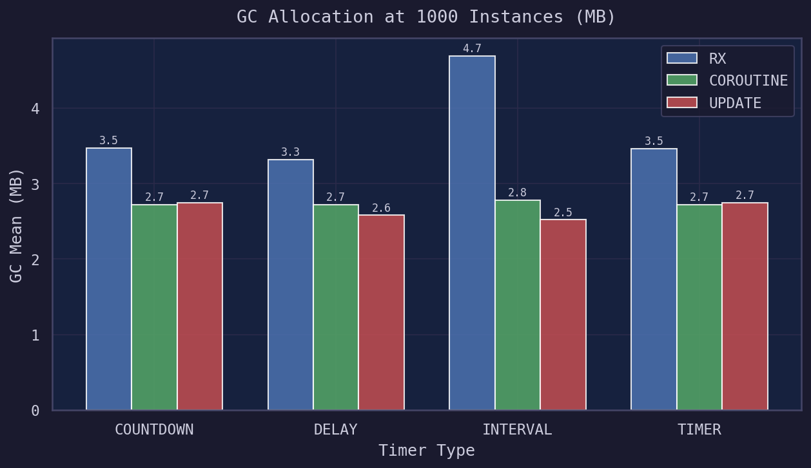
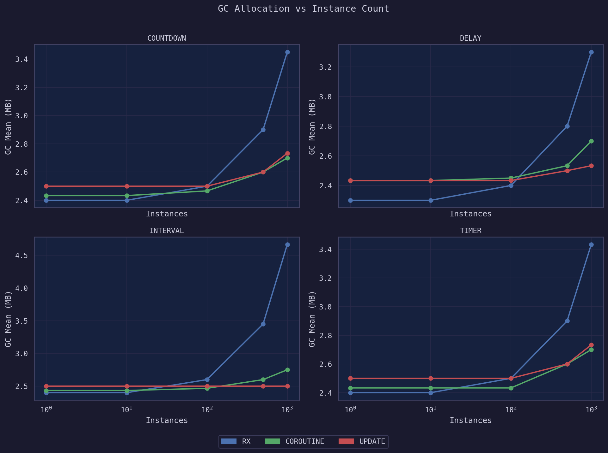
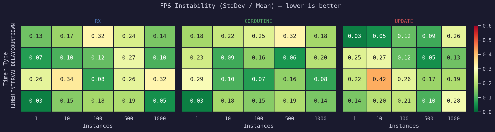
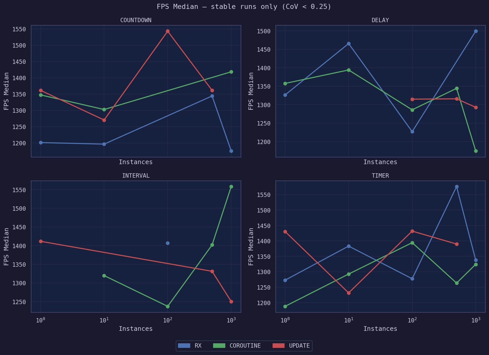

# Unity Timer Benchmark

> A performance research tool and study comparing three Unity timer implementations:
> **UniRx (Reactive Extensions)**, **Coroutine-based** and **Update-loop** timers -
> measured on real IL2CPP standalone builds, not in the Editor.


---

## Key Findings

> All measurements were taken in **IL2CPP standalone builds**.
> Editor (Mono) results differ by orders of magnitude due to JIT overhead and are not valid for production conclusions.

- 📊 **GC pressure scales with instance count in all drivers** - but UniRx allocates up to **2x more** than Coroutine/Update at 1000 concurrent timers
- 🔁 **Coroutine/Interval is the most stable** timer type - lowest FPS variance (CoV < 0.1) across all instance counts
- ✅ **GC is the most reproducible metric** across independent runs - consistent within ±0.1 MB across 5 separate benchmark sessions
- 🔋 **CPU time shows no significant difference** between implementations at any scale tested
- 🟢 **All implementations remain production-viable** - FPS never drops below 200 even during GC events, well above the 60 FPS threshold

---

## The Benchmark Tool

A standalone Unity application that runs configurable timer benchmarks and visualizes results in real time.

### Screenshots

| Main UI | Results |
|---|---|
| *(screenshot)* | *(screenshot)* |

### Features

- **3 timer drivers** - RX, Coroutine, Update
- **4 timer types** - Delay, Interval, Timer, Countdown
- **5 instance scales** - 1 / 10 / 100 / 500 / 1000 concurrent timers
- Real-time FPS display during benchmarks
- Live charts for FPS, GC Allocation and CPU Time
- Export results to CSV
- **Suite mode** - runs the full benchmark matrix automatically (60 configurations)

---

## Results

### GC Allocation at 1000 Instances

UniRx consistently allocates more GC memory than Coroutine and Update drivers,
especially for Interval and Timer types.



### GC Scaling Across Instance Counts

All drivers show linear GC growth with instance count.
UniRx diverges noticeably above 500 instances.



### FPS Stability Heatmap

Coefficient of Variation (StdDev / Mean) - lower is better.
Green = stable, Red = high variance.
Coroutine/Interval stands out as the most predictable implementation.



### FPS Median (Stable Runs Only)

Filtered to configurations where CoV < 0.25 to exclude spike-affected measurements.



---

## Methodology

| Parameter | Value |
|---|---|
| Build type | IL2CPP Standalone (Windows x64) |
| Scripting backend | IL2CPP |
| GC mode | Incremental GC |
| Benchmark duration | 2 seconds per run |
| Metrics interval | 0.5 seconds (10 samples per run) |
| Warmup | 3 seconds before suite start |
| Cooldown between runs | 1 second |
| Cooldown between scenarios | 2 seconds |
| Runs per suite | 5 independent sessions |
| FPS source | `1 / Time.deltaTime` sampled at 0.25s intervals |
| GC source | `GC.GetTotalMemory(false)` in MB |
| CPU source | `ProfilerRecorder` - Main Thread (nanoseconds -> ms) |

> **Note on FPS variance:** FPS variance reflects Unity's incremental GC cycle behavior -
> periodic pauses are a normal part of the runtime, present equally across all drivers.
> FPS never drops below 200 during GC events, well above the 60 FPS threshold for smooth operation.
> This confirms all three implementations remain production-viable at any tested instance count.

---

## Architecture

The tool is designed with clean separation of concerns and minimal coupling between components.

```
AppInstaller (composition root)
│
├── BenchmarkPresenter          <- orchestrator, owns all services
│   ├── SingleBenchmarkRunner   <- one config, one run
│   └── SuiteBenchmarkRunner    <- full matrix, sequential execution
│
├── ITimerFactory               <- creates ITimer by TimerDriver enum
│   ├── RxTimer
│   ├── CoroutineTimer
│   └── UpdateTimer
│       └── UpdateTimerRunner   <- MonoBehaviour tick loop
│           └── ITimerTask      <- DelayTask / IntervalTask / IntervalCountTask
│
├── IMetricsCollector           <- Begin() -> Tick() x N -> Complete()
│   └── MetricsCollector        <- FPS / GC / CPU via ProfilerRecorder
│
└── Views (passive, message-driven)
    ├── BenchmarkView           <- config input, button states
    ├── ChartView               <- XCharts line/bar rendering
    ├── ReporterView            <- save dialog, file path management
    ├── PopupView               <- validation error messages
    ├── BlurScreenView          <- fullscreen blur overlay (Resources shader)
    └── LoaderView              <- sprite-sheet spinner animation
```

### Key Design Decisions

**`ITimer` abstraction** - all three implementations share one interface.
Benchmarks are driver-agnostic; swapping RX -> Coroutine -> Update requires zero changes in runner code.

**`BenchmarkRunnerBase`** - shared logic (timer spawning, blur control, FPS caching)
extracted to a base class. `SingleBenchmarkRunner` and `SuiteBenchmarkRunner` only implement their specific execution strategies.

**`UpdateTimerRunner` + `ITimerTask`** - Update-loop timers avoid coroutine overhead
by maintaining a flat `List<ITimerTask>` ticked every frame. New tasks are buffered in a pending list
to avoid modifying the active list mid-iteration.

**MessageBroker (UniRx)** - used selectively for truly decoupled events (blur, popup, chart creation)
where components have no reason to know about each other.
Direct C# events are used everywhere else.

---

## Tech Stack

| | |
|---|---|
| Engine | Unity 2022.3 LTS |
| Language | C# |
| Timer library | UniRx (Reactive Extensions for Unity) |
| Charts | XCharts 3.x |
| Tweening | DOTween |
| File dialogs | StandaloneFileBrowser (IL2CPP-compatible) |
| Data analysis | Python 3 / pandas / matplotlib / seaborn |

---

## Repository Structure

```
unity-timer-benchmark/
├── results/
│   ├── csv/                    <- raw benchmark data (5 suite runs)
│   ├── charts/                 <- generated PNG visualizations
│   └── generate_charts.py      <- aggregation & chart generation script
└── README.md
```

> The Unity project source is maintained separately.
> This repository focuses on benchmark results, analysis and tooling.

---

## Reproducing the Charts

```bash
pip install pandas matplotlib seaborn
cd results
python generate_charts.py
```

Charts are saved to `results/charts/`.

---

## License

MIT
